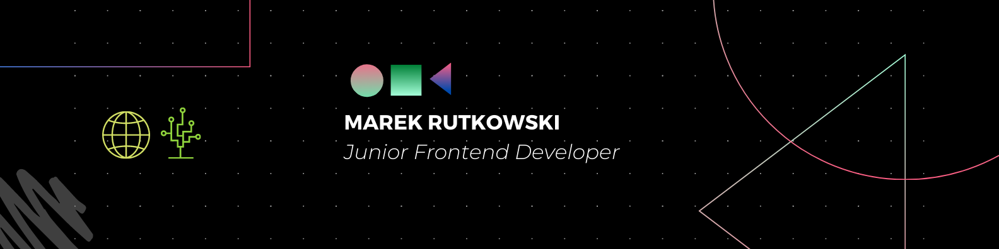

## Hello there, 👋

My name is Marek Rutkowski and I am aspiring junior frontend developer 🎆. I have graduated with a Master's degree in Computer Science 🎓 from Wrocław University of Science and Technology 🏛️. I am passionate about web development with an eagerness to learn new technologies💡. Want to reach out to me? Get in touch with me on .

 
 

## 📌 Pinned Repositories

 

 
 

## 💼 Skills

 

 

## &#x1f4c8; GitHub Stats

 

